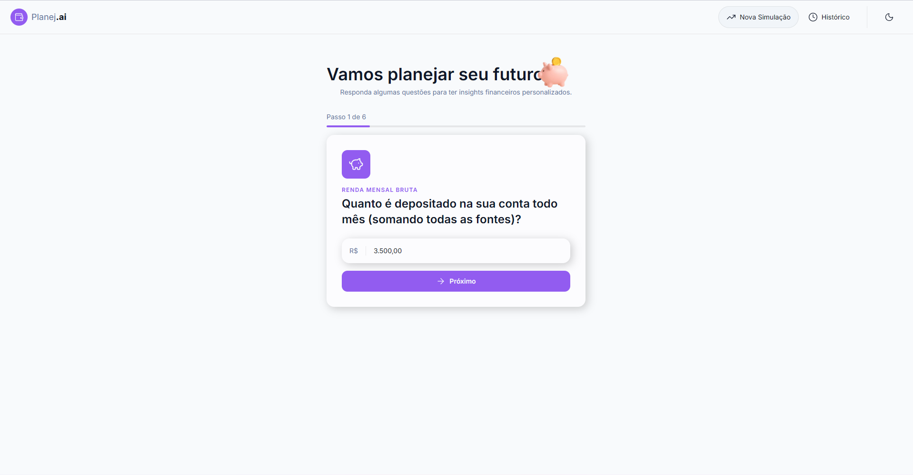
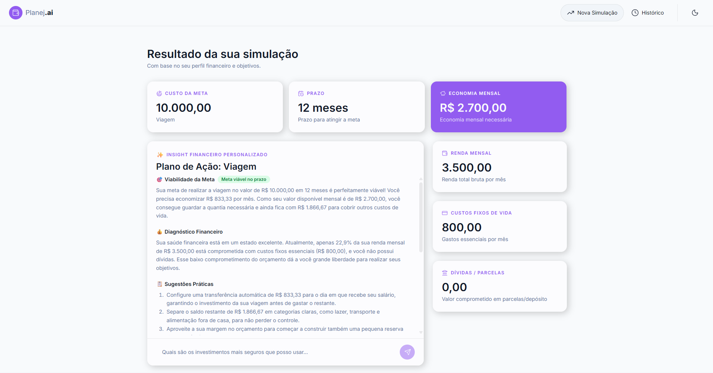

# 💡 Planej.ai — Educador Financeiro Inteligente

Aplicação web de planejamento financeiro pessoal desenvolvida como desafio prático da [Digital Innovation One (DIO)](https://www.dio.me/): *"Desenvolvendo Seu Educador Financeiro Inteligente Com React e IA Generativa"*.

O usuário responde um formulário guiado sobre sua renda, custos fixos, dívidas e uma meta financeira. A aplicação calcula a viabilidade da meta e usa a API do **Google Gemini** para gerar um diagnóstico personalizado — com sugestões de economia, ideias de renda extra e um assistente de chat contextual para tirar dúvidas sobre a simulação.

Tudo roda 100% no navegador: sem backend e sem banco de dados. Os dados ficam salvos no `localStorage`.

> 📸 *Screenshots do fluxo (formulário → resultado → chat).*





## 🎯 Funcionalidades

- **Simulação guiada em 6 passos** — renda, custos fixos, dívidas, nome da meta, valor da meta e prazo, com barra de progresso e máscara de moeda (R$) aplicada em tempo real.
- **Diagnóstico gerado por IA** — a partir dos dados informados, o Gemini retorna um JSON estruturado com:
  - viabilidade da meta no prazo (com selo visual: viável / precisa de ajuste / inviável);
  - diagnóstico do comprometimento do orçamento;
  - sugestões práticas de economia;
  - ideias de renda extra;
  - sugestões de investimento;
  - mensagem motivacional personalizada com o nome da meta.
- **Assistente de chat contextual** — integrado nativamente ao final do cartão de insights com rolagem ancorada. O contexto financeiro da simulação (renda, custos, dívidas, meta) é injetado como instrução de sistema em cada chamada, e o histórico da conversa é reenviado para manter a continuidade.
- **Histórico de simulações** (`/historico`) — lista todas as simulações já feitas, com opção de excluir (modal de confirmação) ou revisitar os resultados.
- **Tema claro/escuro** — detecta a preferência do sistema operacional no primeiro acesso e persiste a escolha do usuário.
- **Persistência local por simulação** — cada simulação tem um ID único; os dados do formulário, o insight da IA e o histórico do chat ficam salvos juntos, sobrevivendo a um refresh da página.

## 🛠️ Tecnologias

**Principais**

| Pacote | Versão | Uso |
|---|---|---|
| React | 19.2.4 | Interface |
| TypeScript | 5.9.3 | Tipagem estática |
| Vite | 8.0.1 | Build e dev server |
| React Router DOM | 7.13.2 | Roteamento (`/`, `/resultado/:id`, `/historico`) |
| Tailwind CSS | 4.2.2 | Estilização (config *CSS-first*, via `@theme`) |
| Google Gemini API | `gemini-flash-latest` | IA generativa, consumida via REST puro (sem SDK) |
| Lucide React | 1.5.0 | Ícones |
| react-loading-skeleton | ^3.5.0 | Estado de carregamento do insight |

**Desenvolvimento:** ESLint 9 + `typescript-eslint`, Prettier (com `prettier-plugin-tailwindcss`), `eslint-plugin-simple-import-sort` e `eslint-plugin-unused-imports` para manter os imports organizados.

## 📂 Estrutura do projeto

```
src/
├── components/
│   ├── features/
│   │   ├── Simulation/        # Formulário multi-step (Form, FormStep, Progress, Hero)
│   │   ├── SimulationResults/ # Cards de resultado e card de insight da IA
│   │   ├── Insights/          # Conteúdo do diagnóstico e estado de erro
│   │   └── Chat/               # Componente ChatThread integrado ao cartão de resultados
│   ├── layout/                # RootLayout + Header
│   └── shared/                # Button, Input, Divider, PageHero...
├── context/theme/             # ThemeContext + ThemeProvider
├── data/                      # Passos do formulário e prompt da IA
├── hooks/
│   ├── useAsyncAction.tsx     # Controle de concorrência (mutex) + estado async
│   ├── useChat.ts             # Orquestração do chat (optimistic UI + rollback)
│   ├── useInsight.tsx         # Geração e cache do diagnóstico da IA
│   ├── useSimulationStorage.tsx # CRUD das simulações no localStorage
│   └── useTheme.tsx
├── pages/                     # SimulationFormPage, SimulationResultsPage, HistoryPage
├── services/aiService.ts      # Cliente REST da API do Gemini
└── utils/                     # Máscara/parse de moeda, cálculo de economia mensal
```

## ⚙️ Como executar

**Pré-requisitos:** Node.js 20.19+ (ou 22.12+) e [pnpm](https://pnpm.io/).

1. Clone o repositório:
   ```bash
   git clone https://github.com/LucasDev-22/planejai.git
   cd planejai
   ```

2. Instale as dependências:
   ```bash
   pnpm install
   ```

3. Configure a variável de ambiente:

   Crie um arquivo `.env.local` na raiz do projeto com sua chave da API do Google Gemini (gere uma gratuitamente em [aistudio.google.com/apikey](https://aistudio.google.com/apikey)):
   ```
   VITE_GEMINI_API_KEY=sua_chave_aqui
   ```

4. Inicie o servidor de desenvolvimento:
   ```bash
   pnpm run dev
   ```

Outros scripts disponíveis: `pnpm run build` (build de produção), `pnpm run preview` (preview do build) e `pnpm run lint`.

## 🧪 Como testar o fluxo principal

1. Abra a aplicação e preencha o formulário de simulação (ex: Renda: 5.000, Custos: 3.000, Dívidas: 500, Meta: 10.000, Prazo: 12 meses).
2. Aguarde o processamento — a tela de resultados exibirá os cards com as métricas calculadas e o diagnóstico gerado pela IA.
3. Role até o final do cartão de insights e utilize o campo de texto do chat para fazer uma pergunta contextual, como *"Como posso reduzir meus custos fixos em 10%?"*.
4. Atualize a página (F5) para confirmar que os insights e o histórico do chat foram preservados pelo cache local.
5. Acesse **Histórico** no menu superior para ver todas as simulações salvas e testar a exclusão de uma delas.

## 🧠 Decisões técnicas de destaque

Para atender aos requisitos de UX do desafio, o Assistente de Chat foi integrado nativamente ao cartão de insights. A arquitetura UI utiliza CSS Flexbox de forma avançada (flex-1 overflow-y-auto para isolar a rolagem do histórico e shrink-0 para blindar o formulário no rodapé), garantindo que o input do usuário permaneça visível no mobile, não importa o tamanho da resposta da IA.

- **`useAsyncAction`** — hook genérico que envolve qualquer função assíncrona com um *mutex* via `useRef` (evita disparos duplicados), rastreamento de montagem do componente (evita `setState` após unmount, um cuidado importante com o *Strict Mode* do React) e um estado padronizado de `{ data, isLoading, error }`. É reutilizado tanto pela geração do diagnóstico (`useInsight`) quanto pelo chat (`useChat`).
- **UI otimista com rollback no chat** — ao enviar uma mensagem, `useChat` insere a mensagem do usuário na tela e no `localStorage` antes mesmo da resposta da IA chegar. Se a chamada falhar, a mensagem é revertida tanto da tela quanto do cache, evitando um histórico inconsistente (o que quebraria o contrato `role: user` / `role: model` esperado pela API em chamadas futuras).
- **Persistência estruturada** — cada simulação é um registro único (identificado por `crypto.randomUUID()`) contendo os dados do formulário, o insight da IA e o histórico do chat, tudo salvo sob uma única chave no `localStorage`, com leitura protegida por `try/catch` contra dados corrompidos.

## 🎨 Design

O layout segue o protótipo disponível no [Figma do desafio](https://www.figma.com/design/MVZhmZxoVAsgotZo50gj6M/Educador-Financeiro---DIO?node-id=29-403&t=Cv4vW38VUtwwLO3Z-1).

## 🧠 O que aprendi

- **Tratamento de efeitos colaterais:** como o Strict Mode do React 19 afeta o ciclo de montagem/desmontagem, e como estabilizar referências assíncronas com `useRef` para evitar corridas de requisição.
- **Gestão de estado complexo:** construir um mecanismo de rollback para proteger o cache local contra respostas inválidas ou falhas de rede.
- **Consumo de APIs de LLM:** estruturar requisições para a API do Gemini com histórico de contexto (`role: user` / `role: model`) usando apenas `fetch`, sem depender de SDKs — incluindo como pedir e validar uma resposta em JSON estruturado.

## 📄 Licença

Este projeto não possui uma licença definida. Se pretende reutilizá-lo ou publicá-lo, considere adicionar uma (ex: [MIT](https://choosealicense.com/licenses/mit/)).

---

Desenvolvido por [LucasDev-22](https://github.com/LucasDev-22) como parte do bootcamp da [DIO](https://www.dio.me/).
